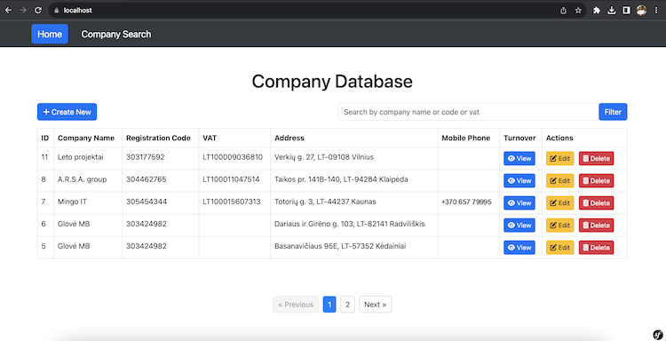
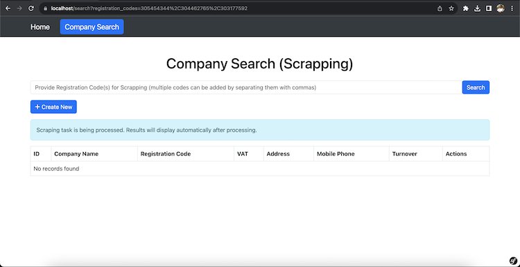
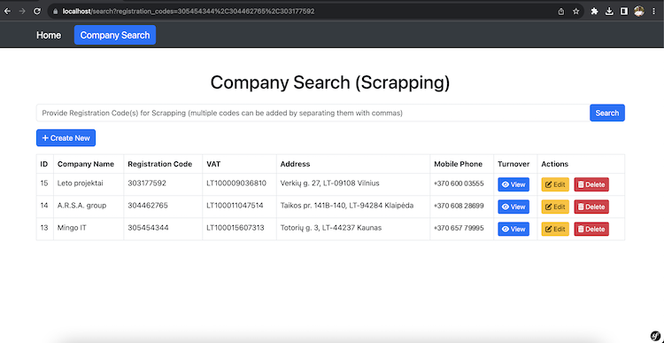
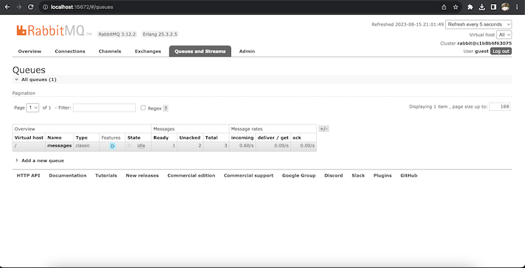

# Dockerized Company Data Scraper with Symfony 6.2

This project entails the development of a comprehensive Dockerized stack, integrating Nginx, PHP 8.2, MySQL 8, RabbitMQ, and Redis. Leveraging Symfony 6.2 framework, the primary objective is to create a robust web scraper capable of extracting essential company information from https://rekvizitai.vz.lt/en/company-search/. This information encompasses crucial details such as Company Name, Registration Code, VAT, Address, and Mobile Phone. Moreover, the scraper will also extract turnover information from the "XXX turnover for the year" table on the company profile page.

## Table of Contents
- [Functional Descriptions](#functional-descriptions)
- [Technologies Used](#technologies-used)
- [Setup Guide](#setup-guide)
- [Test Run Instruction](#test-run-instruction)
- [Video Tutorial](#video-tutorial)
- [Scope for Improvement](#scope-for-improvement)
- [Screenshots](#screenshots)
- [Contributing](#contributing)
- [License](#license)

## Functional Descriptions
- **Dockerized Stack:** The project utilizes Docker to create a seamless and portable environment, ensuring consistent deployment across different systems.
- **Symfony 6.2 Framework:** Symfony, renowned for its versatility and rapid development capabilities, is employed as the core framework to implement the company data scraper and the associated web application. 
- **Data Extraction and Scraper:** The custom-built scraper will automatically retrieve the specified information from the company profiles on the provided website. This includes Company Name, Registration Code, VAT, Address, Mobile Phone, and Turnover details.
- **Search Bar with Registration Code:** The user-friendly interface will feature a search bar that accepts a registration code as input. Upon entering the registration code, users can initiate the scraping process to retrieve the necessary company information.
- **CRUD Functionality:** The scraped company data can be easily managed through the application's CRUD (Create, Read, Update, Delete) functionalities. This ensures effortless manipulation of stored data.
- **Filtering and Pagination:** The application incorporates advanced filtering options, enabling users to refine data based on specific criteria. Additionally, pagination enhances the accessibility of large datasets.
- **Multi-Code Search Capability:** As an added convenience, the search bar is equipped to handle multiple registration codes, which can be inputted by comma(,) separation and processed simultaneously.
- **RabbitMQ Integration:** The project employs RabbitMQ to efficiently manage and distribute queries within the scraper. This enhances performance and optimizes resource allocation.

## Technologies Used
- Nginx
- PHP 8.2
- MySQL 8
- RabbitMQ
- Redis
- Symfony 6.2


## Setup Guide
To get the project up and running on your local machine, follow these steps:

- **Prerequisite:** If not already done, [install Docker Compose](https://docs.docker.com/compose/install/)

- Clone the repo and navigate into it:
```bash
git clone https://github.com/shohanjh09/web-scrapper.git
cd web-scrapper
```
- Rename or copy `.env.dist` file to `.env`
- Update the SCRAPPING_PROXY_TOKEN in the .env file. Get the token from the following URL (details in project setup video):
  https://dashboard.scrape.do/login

- Build and start the Docker containers:
```bash
docker-compose up --build -d
```

- Access the application container:

```bash
docker-compose exec app sh
```

- Install the required dependencies inside the application container:

```bash
composer install
```

- create column and table in database by running the command inside the application container:
```bash
php bin/console doctrine:migrations:migrate
```

- Visit `https://localhost` or `http://localhost` in your browser
- Visit `http://localhost:8080` (username: root, password: 123) in your browser to access phpMyAdmin
- Visit `http://localhost:15672` (username: guest, password: guest) in your browser to access RabbitMQ

## Test run instruction:
- Ensure Docker containers are built and started:
```bash
docker-compose up --build -d
```

- Access the application container:

```bash
docker-compose exec app sh
```

- Create the test database in the application container:
```bash
php bin/console --env=test doctrine:database:create
```
- create column and table in the test database in the application container
```bash
php bin/console --env=test doctrine:schema:create
```
Run the tests in the application container (details in Test Run video):
```bash
php bin/phpunit
```

## Screenshots





## Video Tutorial
- Application feature demonstration: [Video Link](https://drive.google.com/file/d/1Fj00ylF6h8xg1V7l8xyMRD8MKsKqX5PU/view?usp=sharing)
- Project setup: [Video Link](https://drive.google.com/file/d/13mWPxTH5nDLMPgjHj5Q0tRFpfhGAP7DA/view?usp=sharing)
- Test Run: [Video Link](https://drive.google.com/file/d/108KMGy48aFn2ex4YJcM9zJbQbApFweEw/view?usp=sharing)

## Scope for Improvement:
As a result of time constraints, not all aspects could be addressed. Nevertheless, the potential areas for enhancement include:
- Expanding the test suite, particularly focusing on the scraping services.
- Extending CRUD functionality to cover turnover information as well.
- Enhancing the overall UI/UX for a more user-friendly experience.
- Implementing a Login feature to restrict CRUD operations to authorized users only.

## Contributing
Contributions are welcome! If you find any bugs or want to enhance the functionality, feel free to submit pull requests or issues.

## License
This project is licensed under the MIT License.
